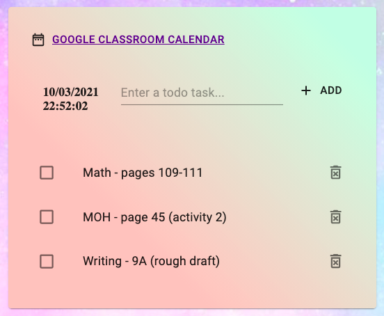

# homework-todo

A simple homework todo app built with React, GraphQL, MongoDB and Material-UI.

## Motivation

A web application for my daughter; to keep track of homework to be completed with current date and time display plus a link to Google Classroom Calendar of weekly assignments.

## Setup

### Dependencies

- `cd server` and run `npm install`. This will install server-related dependencies.
- `cd client` and run `npm install`. This will install client dependencies.

### Run Development Server

- `cd server` and run `node index.js` to start server on port 4000.
- `cd client` and run `npm start` to run development build. The app will run on `http://localhost:3000` as the default port.
